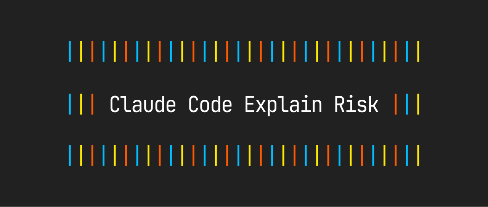

<p align="center">
  
</p>

# Claude Code Explain Risk

**Claude Code の許可ダイアログに、操作のリスクを分かりやすく表示するツール**

[English](README.md)

---

Claude Code を使っていると「このコマンドを許可しますか？」というダイアログが表示されますが、何が起きるのか分かりにくいことがあります。

このツールを入れると、コマンドのリスクレベル（低・中・高）と、何をしようとしているかの説明が表示されるようになります。日本語・英語に対応しており、システムの言語設定に合わせて自動で切り替わります。

## 表示例

```
||| リスク: 高
ファイルやフォルダをまとめて削除しようとしています。
削除されたファイルは復元できません。
```

```
|| リスク: 中
npm パッケージをインストールしようとしています。
不正なソフトウェアが含まれる可能性があります。
```

低リスク（`ls`、`cat`、`git status` など）はそのまま通るので、邪魔になりません。

## インストール

```bash
npx claude-code-explain-risk
```

インストール後、Claude Code を再起動すると有効になります。

## アンインストール

```bash
npx claude-code-explain-risk --uninstall
```

## リスクレベル

| レベル | 表示 | 動作 |
|---|---|---|
| 低 | 表示なし | そのまま通ります（Claude Code のデフォルト動作） |
| 中 | 黄色で説明表示 | 操作内容とリスクを説明してから確認 |
| 高 | 赤色で説明表示 | 操作内容とリスクを説明してから確認 |

## 対応コマンド（150+）

### 高リスク（赤）

| カテゴリ | コマンド例 |
|---|---|
| ファイル削除 | `rm -rf`、`find -delete`、`truncate` |
| Git 不可逆操作 | `git push`、`git reset --hard`、`git clean`、`git stash clear` |
| 管理者権限 | `sudo`、`systemctl`、`launchctl` |
| リモート接続 | `ssh`、`scp`、`rsync` |
| 外部スクリプト | `curl \| bash`、`wget \| sh` |
| 権限変更 | `chmod`、`chown` |
| プロセス終了 | `kill`、`killall` |

### 中リスク（黄）

| カテゴリ | コマンド例 |
|---|---|
| パッケージ管理 | `npm install`、`pip install`、`brew install`、`yarn add` |
| Git 操作 | `git add`、`git commit`、`git merge`、`git pull` |
| ファイル操作 | `mkdir`、`cp`、`mv`、`touch` |
| プログラム実行 | `node`、`python3`、`ruby`、`bun` |
| テスト | `jest`、`pytest`、`playwright` |
| ビルド | `make`、`tsc`、`webpack` |
| デプロイ | `firebase deploy`、`vercel`、`gcloud` |
| データベース | `psql`、`mysql`、`sqlite3` |

### 低リスク（表示なし）

| カテゴリ | コマンド例 |
|---|---|
| 基本コマンド | `ls`、`pwd`、`cd`、`echo`、`cat` |
| 検索 | `find`、`grep`、`rg`、`diff` |
| テキスト処理 | `jq`、`sort`、`cut` |
| Git 読み取り | `git status`、`git log`、`git diff` |
| バージョン確認 | `--version`、`--help` |

### 対象外のツール

以下のツールは Claude Code の仕様上、フックの説明テキストを表示できないため対象外です。Claude Code 独自の許可ダイアログがそのまま表示されます。

| ツール | 説明 |
|---|---|
| Edit / Write | ファイルの編集・作成。Claude Code が変更内容を専用UIで表示 |
| WebFetch / WebSearch | Web へのアクセス。アクセス先 URL が専用UIで表示 |
| MCP ツール | 外部サービスとの連携。専用UIで表示 |
| Read / Glob / Grep | ファイルの読み取り・検索。読み取り専用のため自動許可 |

> Claude Code 側で対応が進めば（[#17356](https://github.com/anthropics/claude-code/issues/17356)）、将来的にこれらのツールでもリスク説明が表示されるようになる見込みです。

## 設定との連携

### allow リスト

Claude Code の `settings.json` で許可済みのコマンドには介入しません。フックを入れる前と同じ動作を維持します。

```json
{
  "permissions": {
    "allow": [
      "Bash(git status:*)",
      "Bash(npm test:*)"
    ]
  }
}
```

### Permission Mode

| モード | フックの動作 |
|---|---|
| `default` | allow リストにマッチ → 自動許可 / それ以外 → リスク説明 + 確認 |
| `acceptEdits` | 同上 |
| `dontAsk` | フック介入なし（全て自動承認） |
| `bypassPermissions` | フック介入なし（全て自動承認） |

## 言語

表示言語は自動で判定されます：

1. `LANG` 環境変数（例: `ja_JP.UTF-8` → 日本語）
2. **macOS**: `LANG` が日本語でない場合、システム言語設定（`AppleLocale`）をフォールバックとして使用

| 条件 | 表示言語 |
|---|---|
| `LANG` が `ja` で始まる | 日本語 |
| macOS のシステム言語が日本語 | 日本語 |
| それ以外 | 英語 |

特別な設定は不要です。

## 動作環境

- **Node.js** — Claude Code に同梱されているので追加インストール不要
- **対応OS** — macOS、Linux
- **依存パッケージ** — なし（Node.js 標準ライブラリのみ使用）

## 仕組み

Claude Code の [PreToolUse フック](https://docs.anthropic.com/en/docs/claude-code/hooks) を使っています。Bash コマンドが実行される前にフックが呼ばれ、コマンドのリスクを判定して説明を表示します。

```
Claude Code がコマンドを実行しようとする
  ↓
explain-risk.js が呼ばれる
  ↓
コマンドのリスクを判定（低/中/高）
  ↓
低リスク → そのまま通す
中・高リスク → 説明を表示して確認
```


## 貢献

Issue や PR を歓迎しています！詳しくは [CONTRIBUTING.md](CONTRIBUTING.md) をご覧ください。

- 新しいコマンドの追加リクエスト
- 説明テキストの改善
- バグ報告
- ドキュメントの改善

## ライセンス

[MIT](LICENSE)
